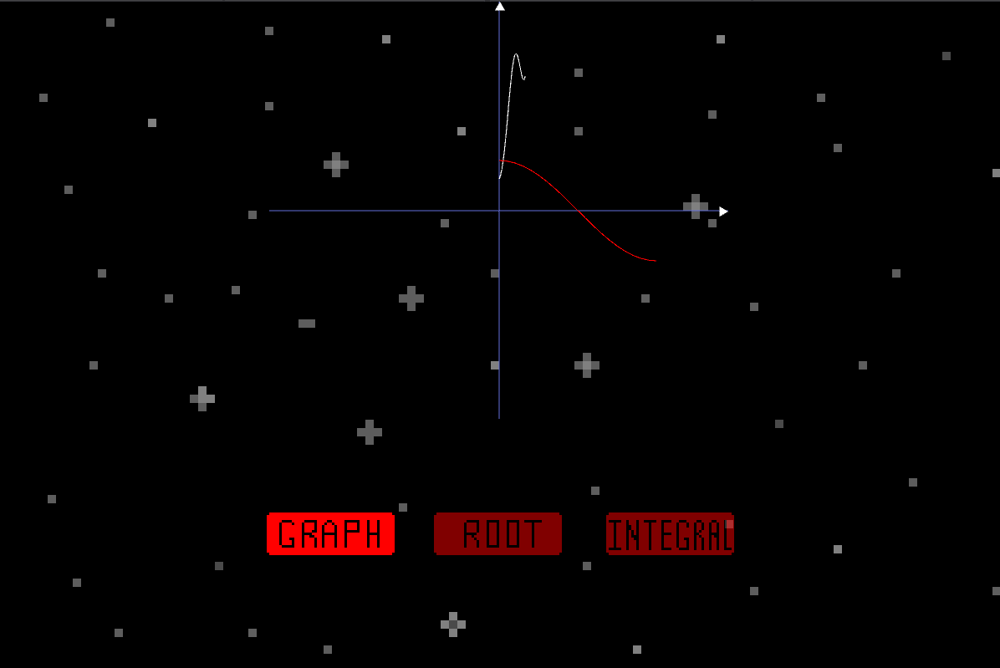

# RGR

Its's calculate and graphic work from my university, but using GUI instead of TUI. SFML is used as a graphics engine for fast prototyping. 

# Plans:
* Make refactor 
* Make input handling as separate module
